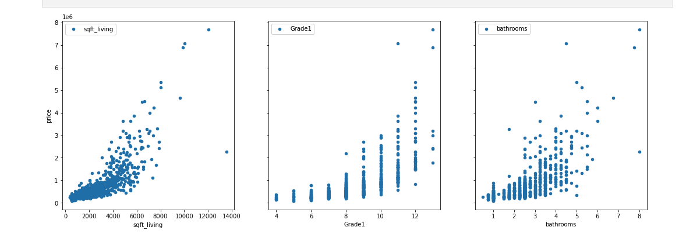
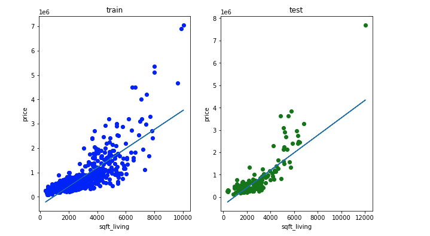
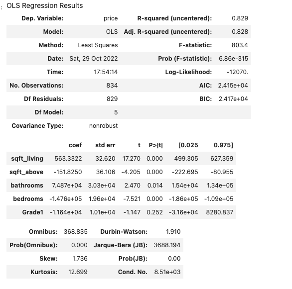

# Phase 2 Project Description

King County Seattle


### Background
In this notebook, an analysis of King County sales data in the United States for years 2014-2015 will be conducted. The purpose of the analysis is to derive conclusions for business decision making purposes, affecting current homeowners and prospective buyers of this specific area. King county, is one of three Washington state counties that include Seattle, Bellevue and Tacoma area. It covers an area of of approximately 39 towns and cities. U.S Census Bureau stats indicate the county has a population of approximately 2.2 million people as of 2020.

### Business Understanding & Business Problem
Understanding that my business stakeholder can be a real estate agency, who would want to advice both buyers and sellers on this market, it is important to note that in this type of business, both buyers and sellers are interested in price. Therefore, it is important to understand the database first, navigage its features, identify what other categories besides price are availble to try to define and predict what exactly is the best correlation to price.


### The Data

This project uses the King County House Sales dataset, which can be found in  `kc_house_data.csv` in the data folder in this assignment's GitHub repository. The description of the column names can be found in `column_names.md` in the same folder. As with most real world data sets, the column names are not perfectly described, so you'll have to do some research or use your best judgment if you have questions about what the data means.

### Hypotheses

Null hypothesis (H0): There is no relationship between our features and our target variable, price.  

Alternative hypothesis (Ha): There is a relationship between our features and our target variable, price.

I will be using a significance level (alpha) of 0.05 to make our determination, and will make our final recommendations accordingly.


### Linearity of the The top 3 correlated attributes : Square Footage, Grade, and Bathrooms




### Regression Modeling run on Python



### OLS Coefficients Determination, P-Values & Model Explained


The important factors to observe in the model above are as follows, The Dependent Variable: Price. R-Squared: 83%, an important measure that compares to the baseline model, its a fitness test and with this value I'm confident that this model works. The sum of squares is divided by Total Sum Squares.
R-Squared Coefficient determination , a "goodness of fit" of the regression model. R-squared is also called the baseline model, and in this cases it indicates almost 83% can be explained by the model.
The F-statistic o P-Value: is the provability that. asample like this would yield the above results, and wether or not the model's veridict on the null hypthesis will consistently represent the population. Since this model yielded a p-value less than 0.05 we can reject the null hypothesis and know that this test is statistically significant

### Conclusion & Recommendations

* People in King County who would like to buy or sell should be aware that there are attributes in their homes that contribute directly to the price of the home in this market
* People who own homes or would like to buy homes King County should know that Square Footage, Grade, and Bathrooms, are the highest and the most directly correlated to home prices
* Prices of Homes in King county are highly and mostly influenced by the Square Footage, the most important factor and highest contributor to the price of a home in King County
* The better built homes, meaning homes with higher grades, increase the price of a King County Home. So Grade level matters when selling a home in this market


## Summary
```
├── README.md                        <- The top-level README for reviewers of this project
├── student.ipynb                    <- Jupyter notebook. Overview, Business Problem, Data Understanding.Regression.
├── RealEstate.pdf                   <- PDF version of project presentation
├── data                             <- the database used 
└── Linearity.png                    <- image sourced externally
└── OLS.png                          <- image sourced externally
└── Regression.png                   <- image sourced internally from notebook
```
